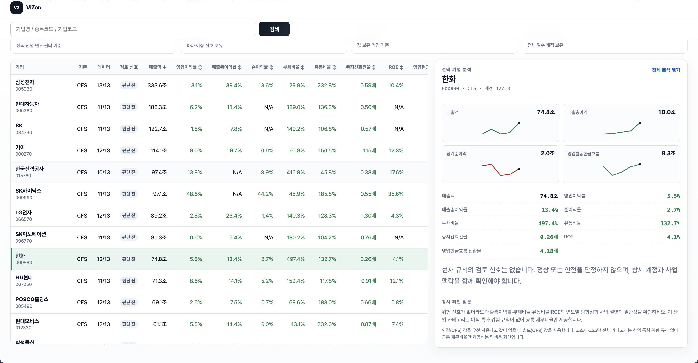

# ViZon

**산업의 경제적 실질과 재무제표 숫자를 함께 읽어, 감사·재무 리스크를 근거와 함께 설명하는 한국 상장기업 분석 플랫폼**

🔗 **Live Demo**: [https://risk-analyzer.pages.dev/](https://risk-analyzer.pages.dev/)


|

---

## 프로젝트 소개

*개인 프로젝트 · 기획·설계·개발·배포·운영 전 과정 단독 수행*

회계법인의 감사인·재무분석 담당자는 숫자를 찾는 데서 업무가 끝나지 않습니다. 산업에 맞지 않는 비교군, 연결/별도 혼용, 수익인식 방식의 차이, 회사마다 제각각인 계정명 때문에 숫자의 의미를 다시 해석해야 합니다.

**ViZon**은 이 과정을 하나의 흐름으로 연결합니다 — 기업/산업 선택 → 비교군 확정 → 산업별 핵심 위험 신호 계산 → 시계열·동종분포·원천계정으로 검증 → 감사 관점의 확인 질문과 근거를 리포트로 정리. 코스피·코스닥 상장사 2,600여 개사에 대해 5개년 재무비율 분석을, 방산·반도체·건설 3개 산업에 대해서는 업종 특화 위험 신호까지 제공합니다.

### 제품 설계 원칙

| 원칙 | 의미 |
| --- | --- |
| 점수보다 근거 | 종합 등급은 탐색의 시작일 뿐, 모든 신호는 산식·기간·표본·원천 계정으로 역추적 가능해야 한다 |
| 산업 우선 | 전 산업 공통 비율만으로 결론을 내리지 않는다 — 산업별 위험 라이브러리와 비교군 정책이 먼저다 |
| 데이터 기준을 숨기지 않기 | 연결/별도, 회계연도, 표본 수, 결측과 제외 사유를 항상 화면에 보인다 |
| 판단 보조, 자동 판정 아님 | "고위험"은 감사 의견이나 부실 판정이 아니라 추가 검토 우선순위다 |

---

## 핵심 기능

- **전체 기업 비교 테이블** — 홈 화면에서 산업 탭(전체/방산/반도체/건설/코스피/코스닥)을 전환하며 기업을 검색·정렬·필터링. 매출총이익률·순이익률·부채비율·유동비율·총자산회전율·ROE 등 표준 재무비율을 한 번에 비교
- **산업 특화 위험 신호** — 방산(계약자산·현금화), 반도체(재고·CAPEX 부담), 건설(미청구공사·차입금 의존도) 등 업종별 회계 이슈에 맞춘 신호와 임계값
- **5개년 추이와 동종분포** — 선택 기업의 핵심 계정 5개년 스파크라인, 동종그룹 대비 백분위·사분위 위치
- **근거 추적** — 모든 지표는 산식·데이터 출처(CFS/OFS)·표본 수·제한사항까지 클릭 한 번으로 확인 가능
- **감사 확인 질문 자동 제시** — 위험 신호가 감지되면 "무엇을 확인해야 하는가"를 구체적 질문으로 함께 제공
- **검토 메모·리포트** — 브라우저 저장 검토 메모, 분석 URL 공유, 인쇄용 리포트

---

## 데이터 규모

| 구분 | 커버리지 |
| --- | --- |
| 코스피·코스닥 상장사 | 2,632개사 (전체 실상장사 2,652개사의 99.2%) |
| 방산·반도체·건설 (업종 특화 분석) | 147개사 |
| 분석 기간 | 2021–2025 (5개년), 연결(CFS)/별도(OFS) 동시 확보 |
| 표준 재무비율 계정 | 14개 (매출액·매출원가·매출총이익·영업이익·당기순이익·영업활동현금흐름·자산총계·부채총계·자본총계·유동자산·유동부채·재고자산·매출채권·이자비용) |
| 원천 재무 데이터 | 약 30만 행 (Supabase Postgres) |

---

## 기술 스택

| 영역 | 기술 |
| --- | --- |
| Frontend | React, Vite |
| Backend | FastAPI (Python) |
| Database | Supabase (PostgreSQL) |
| 데이터 소스 | 금융감독원 전자공시(DART) Open API |
| 배포 | Cloudflare Pages (프론트) · Render (백엔드) |

---

## 데이터 파이프라인 — 기술적 하이라이트

상장기업 재무데이터는 "받아오기만 하면 되는" 데이터가 아니었습니다. 실제로 부딪힌 문제와 해결 방식입니다.

**1. 시장 전체 종목 필터링**
코스피·코스닥 시가총액 페이지 전량(4,299건)을 DART corp_code와 매칭한 결과 대부분이 ETF·ETN·우선주·스팩이었습니다. 패턴 분석으로 실제 분석 대상 기업만 2,652개사로 정확히 좁혔습니다.

**2. 계정명 표준화**
같은 "영업이익"도 회사마다 원문 표기가 "영업이익(손실)", "IV.영업이익" 등으로 제각각입니다. 공백·전각괄호 등 표기 노이즈는 `normalize_accounts.py`의 정리 규칙과 XBRL `account_id`·라벨 매칭으로 자동 표준화하고, "IV.영업이익"처럼 자동 정리로 접히지 않는 변형이나 여러 후보가 동시에 매칭되는 경우는 `fill_missing_accounts.py`에서 후보 우선순위(`--account-variants` 순서) 또는 재무제표 내 실제 표시 순서(계정 `ord`)가 낮은 쪽을 선택하는 로직으로 해결합니다. `tests/` 유닛 테스트 22건(계정명 매칭 15건, `ord`/후보 우선순위 해석 4건, 유틸리티 함수 3건)으로 이 두 단계를 검증하며, 100% 통과 상태를 유지합니다 (`backend/.venv/bin/python -m pytest tests/`, 2026-07-21 기준).

**3. 결측 원인 자동 진단**
화면에 N/A로 보이는 값이 전부 같은 이유는 아닙니다. "정말 데이터가 없는 경우"(신규상장이라 과거 재무제표 자체가 없음), "그 계정이 원래 없는 경우"(업종 특성), "값이 비어있는 경우"를 구분하는 진단 도구를 만들어, 진짜 보강이 필요한 셀만 정확히 찾아 DART에서 재추출했습니다.

**4. 안전한 데이터 반영**
모든 적재는 `--validate-only` 검증 전용 모드로 자연키 중복·참조 무결성을 먼저 확인한 뒤에만 운영 DB에 반영하는 2단계 절차를 거칩니다.

---

## 아키텍처

```text
DART Open API (금융감독원 전자공시)
        ↓  수집·표준화·검증
Supabase(PostgreSQL) — 기업 마스터 · 산업/시장 소속 · 산업별 재무 사실
        ↓
FastAPI — 지표 계산 · 위험 신호 규칙 · 근거 API
        ↓
React 분석 워크스페이스 (Cloudflare Pages)
```

- `companies_basic`: 법인코드 중심 기업 마스터
- `industry_map`: 기업 ↔ 산업/시장 다중 소속 관계 (한 기업이 "방산"이면서 동시에 "코스피"에 속할 수 있음)
- 산업별 재무 사실 테이블: `corp_code + year + fs_div + account_name` 자연키로 정규화된 재무 데이터

---

## 접근 제어

API(`backend/app/main.py`)는 별도 로그인·인증 절차 없이 모든 엔드포인트를 공개 조회(GET) 전용으로 제공합니다. CORS는 배포된 프론트엔드 도메인(`*.pages.dev`, localhost 개발 서버)으로만 제한하지만, 사용자 인증 자체는 두지 않았습니다. 감사인·재무분석 담당자가 회의·현장 검토 중 계정 생성이나 로그인 절차 없이 바로 링크를 열어 근거를 확인할 수 있어야 한다는 목적에 따른 설계이며, 데이터 자체는 DART 전자공시로 이미 공개된 재무제표를 가공한 결과입니다.

---

## 로컬 실행

```bash
# 백엔드
cd backend
python3 -m venv .venv && source .venv/bin/activate
pip install -r requirements.txt
uvicorn app.main:app --reload --port 8000

# 프론트엔드
cd frontend
npm install
npm run dev
```

환경변수(`backend/.env`, `frontend/.env`)는 `SUPABASE_DATABASE_URL`, `DART_API_KEY`, `VITE_API_BASE_URL` 등이 필요합니다.

계정명 표준화·`ord` 우선순위 로직에 대한 유닛 테스트는 pandas가 설치된 `backend/.venv`로 실행합니다.

```bash
backend/.venv/bin/pip install pytest
backend/.venv/bin/python -m pytest tests/
```

---

## 다음 단계

- 표준 재무비율을 활용한 산업 간 비교·스크리닝 UI 확장
- 건설업 A/B/C 비교군의 업무 기준 승인 및 정식 반영
- CFS/OFS 기준을 계정 단위로 세분화해 데이터 유실 없이 표시
- 적재 이력·롤백, 역할 기반 접근 제어 등 운영 안정성 강화
  - 두 항목 중 현재 구조에서 가장 적은 작업으로 구현 가능한 쪽은 **적재 이력·롤백**입니다. 이미 `--validate-only` 2단계 적재 절차가 있어 적재 시점마다 스냅샷(또는 Supabase 테이블 버전 컬럼)만 추가하면 되는 확장이기 때문입니다. 역할 기반 접근 제어는 현재 [접근 제어](#접근-제어) 설계(무인증 공개 조회)와 목적이 상충해 인증 체계 자체를 새로 들여와야 하므로 작업량이 더 큽니다. (제안 단계이며 아직 구현하지 않았습니다.)

---

## 용어와 면책

- **위험 신호**: 추가 검토가 필요한 패턴. 오류·부정·감사의견을 단정하지 않습니다.
- **비교군**: 선택한 산업/시장과 데이터 충족 조건을 통과한 기업 집합.
- **CFS/OFS**: 연결재무제표/별도재무제표 기준.

ViZon의 결과는 전문가의 판단을 돕기 위한 분석 보조 정보이며, 감사 결론·투자 조언·신용 판단을 대체하지 않습니다.
